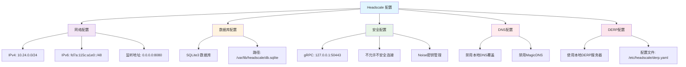
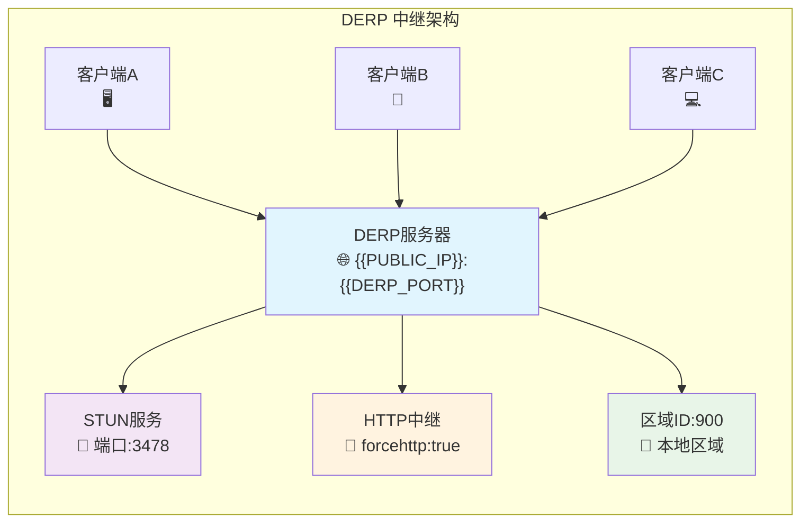
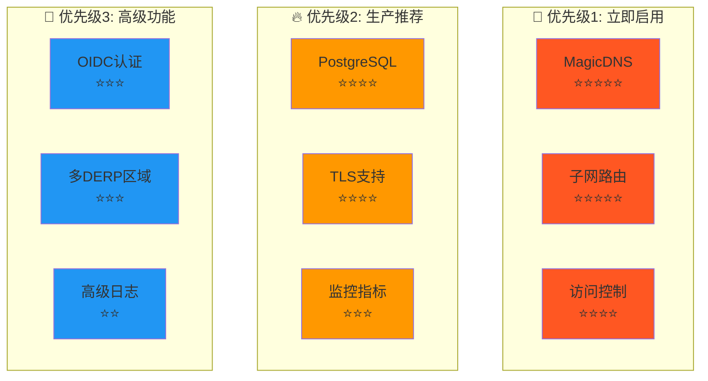

# Headscale 配置文件完整使用指南

[](README.md)
[](CONFIGURATION_GUIDE.md)
[](TODO.txt)

> 本文档详细介绍 Headscale 和 DERP 的配置文件功能、使用方法和最佳实践建议。

## 📋 目录

- [当前配置功能分析](#当前配置功能分析)
- [配置架构图](#配置架构图)
- [可用但未启用的功能](#可用但未启用的功能)
- [强烈推荐的功能配置](#强烈推荐的功能配置)
- [配置升级路径](#配置升级路径)
- [最佳实践](#最佳实践)
- [常见问题](#常见问题)

---

## 📊 当前配置功能分析

### 🔧 Headscale 配置 (config.yaml)

#### 已实现的核心功能



#### 当前功能状态表

| 功能模块 | 状态 | 配置项 | 说明 |
|---------|------|--------|------|
| 🌐 **基础网络** | ✅ 已启用 | `server_url`, `listen_addr` | IPv4/IPv6 地址分配 |
| 💾 **数据存储** | ✅ 已启用 | `database.type: sqlite3` | 适合中小规模部署 |
| 🔒 **安全通信** | ✅ 已启用 | `grpc_*`, `noise.*` | gRPC + Noise 协议加密 |
| 🔗 **服务发现** | ✅ 已启用 | `derp.paths` | 本地 DERP 中继服务器 |
| 🐳 **容器化** | ✅ 已启用 | 所有路径配置 | Docker 环境路径适配 |
| 🌍 **MagicDNS** | ❌ 未启用 | `dns.magic_dns: false` | **强烈推荐启用** |
| 🛡️ **访问控制** | ❌ 未配置 | `acl_policy_path` | **企业环境必需** |
| 🚀 **子网路由** | ❌ 未启用 | `routes.enabled` | **高级网络功能** |

### 🌐 DERP 配置 (derp.yaml)

#### 已实现的中继功能



#### DERP 功能特性表

| 功能特性 | 状态 | 配置值 | 用途说明 |
|---------|------|--------|---------|
| 🏢 **区域化部署** | ✅ 配置 | `regionid: 900` | 单区域本地DERP |
| 📡 **NAT穿透** | ✅ 启用 | `stunport: 3478` | STUN服务器支持 |
| 🔗 **HTTP中继** | ✅ 强制 | `forcehttp: true` | 便于防火墙通过 |
| ⚡ **直连优化** | ✅ 支持 | `stunonly: false` | P2P直连尝试 |
| 🐳 **容器适配** | ✅ 完成 | 端口映射配置 | Docker网络集成 |

---

## 🚀 可用但未启用的功能

### 1. 🌟 高级网络功能（强烈推荐）

#### MagicDNS - 用户体验革命性提升
```yaml
# 🌟 推荐等级: ⭐⭐⭐⭐⭐ (必须启用)
dns:
  magic_dns: true                            # 启用魔法DNS
  override_local_dns: true                   # 覆盖本地DNS
  nameservers:
    - 1.1.1.1                               # Cloudflare DNS
    - 8.8.8.8                               # Google DNS
  search_domains:
    - internal.company.com                   # 内部搜索域
  extra_records:                            # 自定义DNS记录
    - name: "router.internal"
      type: "A" 
      value: "10.24.0.1"
    - name: "nas.internal"
      type: "A"
      value: "10.24.0.100"
```

**效果对比:**
```bash
# 启用前 - 需要记住IP地址
ssh user@10.24.0.5

# 启用后 - 可以使用设备名
ssh user@server-01
ping nas.internal
curl http://router.internal/admin
```

#### 访问控制列表 - 企业安全必备
```yaml
# 🌟 推荐等级: ⭐⭐⭐⭐ (企业必需)
acl_policy_path: "/etc/headscale/acl.yaml"

# ACL策略文件示例 (/etc/headscale/acl.yaml)
{
  "groups": {
    "group:admin": ["admin@company.com"],
    "group:developer": ["dev1@company.com", "dev2@company.com"],
    "group:intern": ["intern@company.com"]
  },
  "acls": [
    {
      "action": "accept",
      "users": ["group:admin"], 
      "ports": ["*:*"]
    },
    {
      "action": "accept",
      "users": ["group:developer"],
      "ports": ["*:22,80,443,3000-4000"]
    },
    {
      "action": "accept", 
      "users": ["group:intern"],
      "ports": ["10.24.0.100:80,443"]
    }
  ]
}
```

#### 子网路由 - 网络扩展核心
```yaml
# 🌟 推荐等级: ⭐⭐⭐⭐⭐ (关键功能)
routes:
  enabled: true                              # 启用子网路由
  subnet_routers: []                         # 子网路由器列表

# 使用示例
# 1. 设置办公室网络路由器
headscale routes enable-subnet-router myserver 192.168.1.0/24

# 2. 访问办公室所有设备
ping 192.168.1.100    # 办公室打印机
ssh 192.168.1.200     # 办公室服务器
```

### 2. 🏢 企业级数据库支持

#### PostgreSQL - 生产环境推荐
```yaml
# 🌟 推荐等级: ⭐⭐⭐⭐ (生产必需)
database:
  type: postgres
  postgres:
    host: localhost                          # 数据库主机
    port: 5432                              # 端口
    name: headscale                         # 数据库名
    user: headscale                         # 用户名
    pass: "your_secure_password"            # 密码
    ssl: prefer                             # SSL模式
    max_open_conns: 10                      # 最大连接数
    max_idle_conns: 2                       # 最大空闲连接
    conn_max_lifetime: 3600                 # 连接最大生存时间

# 性能对比表
# | 数据库类型 | 适用规模 | 并发性能 | 可靠性 | 维护复杂度 |
# |-----------|---------|---------|-------|-----------|
# | SQLite3   | <100节点 | 中等     | 良好   | 简单      |
# | PostgreSQL| >100节点 | 优秀     | 极佳   | 中等      |
# | MySQL     | >100节点 | 良好     | 良好   | 中等      |
```

#### MySQL - 备选方案
```yaml
# 🌟 推荐等级: ⭐⭐⭐ (备选)
database:
  type: mysql
  mysql:
    host: localhost
    port: 3306
    name: headscale
    user: headscale
    pass: "your_secure_password"
    charset: utf8mb4
```

### 3. 🔐 认证和授权增强

#### OIDC企业认证集成
```yaml
# 🌟 推荐等级: ⭐⭐⭐ (企业推荐)
oidc:
  issuer: "https://auth.company.com"         # OIDC提供商
  client_id: "headscale"                     # 客户端ID
  client_secret: "your_client_secret"       # 客户端密钥
  scope: ["openid", "profile", "email"]     # 权限范围
  allowed_domains: ["company.com"]          # 允许的域名
  allowed_groups: ["headscale-users"]       # 允许的用户组
  strip_email_domain: true                  # 去除邮箱域名

# 支持的OIDC提供商:
# - Microsoft Azure AD
# - Google Workspace  
# - Okta
# - Auth0
# - Keycloak
# - 自建OIDC服务
```

### 4. 📊 监控和日志

#### 日志配置增强
```yaml
# 🌟 推荐等级: ⭐⭐⭐ (运维必需)
log:
  level: info                               # debug|info|warn|error
  format: json                              # json|text (推荐json)
  
# 指标暴露 (Prometheus)
metrics_listen_addr: "127.0.0.1:9090"      # Prometheus metrics端点

# 高级配置
disable_check_updates: true                # 禁用自动更新检查
ephemeral_node_inactivity_timeout: "30m"   # 临时节点超时
node_update_check_interval: "10s"          # 节点状态检查间隔
```

### 5. 🔒 TLS和安全增强

#### Let's Encrypt 自动证书
```yaml
# 🌟 推荐等级: ⭐⭐⭐⭐ (生产必需)
tls:
  letsencrypt:
    hostname: "headscale.company.com"       # 域名
    cache_dir: "/var/lib/headscale/cache"   # 证书缓存目录
    challenge_type: "TLS-ALPN-01"           # 验证类型
    email: "admin@company.com"              # 联系邮箱

# 手动证书配置
tls:
  cert_path: "/etc/ssl/certs/headscale.crt"
  key_path: "/etc/ssl/private/headscale.key"
```

---

## 🌟 强烈推荐的功能配置

### 配置优先级矩阵



### 🎯 推荐配置组合

#### 场景1: 个人/小团队使用
```yaml
# 最小推荐配置
dns:
  magic_dns: true                           # ⭐⭐⭐⭐⭐
  override_local_dns: true
  nameservers: ["1.1.1.1", "8.8.8.8"]

routes:
  enabled: true                             # ⭐⭐⭐⭐⭐

# 保持默认SQLite数据库
```

#### 场景2: 中小企业使用  
```yaml
# 企业推荐配置
dns:
  magic_dns: true                           # ⭐⭐⭐⭐⭐
  override_local_dns: true
  nameservers: ["1.1.1.1", "8.8.8.8"]

routes:
  enabled: true                             # ⭐⭐⭐⭐⭐

acl_policy_path: "/etc/headscale/acl.yaml" # ⭐⭐⭐⭐

database:
  type: postgres                            # ⭐⭐⭐⭐
  postgres: {...}

tls:
  letsencrypt: {...}                        # ⭐⭐⭐⭐

metrics_listen_addr: "127.0.0.1:9090"      # ⭐⭐⭐
```

#### 场景3: 大型企业使用
```yaml
# 完整企业配置
dns:
  magic_dns: true                           # ⭐⭐⭐⭐⭐
  override_local_dns: true
  nameservers: ["internal-dns.company.com"]
  search_domains: ["internal.company.com"]

routes:
  enabled: true                             # ⭐⭐⭐⭐⭐

acl_policy_path: "/etc/headscale/acl.yaml" # ⭐⭐⭐⭐

database:
  type: postgres                            # ⭐⭐⭐⭐
  postgres: {...}

oidc:                                       # ⭐⭐⭐
  issuer: "https://auth.company.com"
  client_id: "headscale"
  {...}

tls:
  letsencrypt: {...}                        # ⭐⭐⭐⭐

metrics_listen_addr: "127.0.0.1:9090"      # ⭐⭐⭐

log:
  level: info                               # ⭐⭐⭐
  format: json

derp:                                       # ⭐⭐⭐
  urls:
    - "https://controlplane.tailscale.com/derpmap/default"
  paths:
    - "/etc/headscale/derp.yaml"
```

---

## 🛤️ 配置升级路径

### 渐进式升级策略


### 具体实施步骤

#### 第一阶段: 用户体验提升 (1-2天)
```bash
# 1. 启用 MagicDNS
./linker.sh config set dns.magic_dns true
./linker.sh config set dns.override_local_dns true
./linker.sh config set dns.nameservers '["1.1.1.1","8.8.8.8"]'

# 2. 启用子网路由
./linker.sh config set routes.enabled true

# 3. 重启服务应用配置
./linker.sh restart
```

#### 第二阶段: 安全性增强 (3-5天)
```bash
# 1. 创建ACL策略文件
./linker.sh config create-acl

# 2. 数据库升级到PostgreSQL
./linker.sh upgrade-database postgres

# 3. 启用TLS
./linker.sh config enable-tls --domain headscale.company.com
```

#### 第三阶段: 企业集成 (1-2周)
```bash
# 1. 集成OIDC认证
./linker.sh config set-oidc --provider azure

# 2. 启用监控
./linker.sh config enable-metrics

# 3. 多区域DERP配置
./linker.sh config add-derp-region --region asia
```

---

## 📚 具体实现指南

### 1. MagicDNS 实现
```bash
# 在 linker.sh 中添加配置选项
./linker.sh install --ip IP --enable-magic-dns
./linker.sh config set dns.magic_dns true
./linker.sh config add-dns-record router.internal 10.24.0.1
```

### 2. ACL 策略管理
```bash
# ACL管理命令
./linker.sh acl create                     # 创建默认ACL
./linker.sh acl add-group admin user@company.com
./linker.sh acl add-rule "group:admin" "*:*"
./linker.sh acl validate                   # 验证ACL语法
./linker.sh acl reload                     # 重新加载ACL
```

#### ACL 策略示例
```yaml
# /etc/headscale/acl.yaml - 完整示例
{
  "groups": {
    "group:admin": ["admin@company.com"],
    "group:developer": [
      "dev1@company.com", 
      "dev2@company.com"
    ],
    "group:intern": ["intern@company.com"],
    "group:contractors": ["contractor@external.com"]
  },
  "acls": [
    {
      "action": "accept",
      "users": ["group:admin"],
      "ports": ["*:*"]
    },
    {
      "action": "accept", 
      "users": ["group:developer"],
      "ports": [
        "*:22",           # SSH访问
        "*:80,443",       # HTTP/HTTPS
        "*:3000-4000",    # 开发端口
        "*:8080-8090"     # 测试端口
      ]
    },
    {
      "action": "accept",
      "users": ["group:intern"],
      "ports": [
        "10.24.0.100:80,443",  # 只能访问特定服务器
        "10.24.0.200:3000"     # 只能访问特定应用
      ]
    },
    {
      "action": "accept",
      "users": ["group:contractors"],
      "ports": ["10.24.0.150:22,80,443"]
    }
  ],
  "ssh": [
    {
      "action": "accept",
      "users": ["group:admin"],
      "checkPeriod": "24h"
    }
  ]
}
```

### 3. 多数据库支持实现
```bash
# 数据库管理命令
./linker.sh database status               # 查看当前数据库状态
./linker.sh database backup               # 备份当前数据库
./linker.sh database migrate postgres     # 迁移到PostgreSQL
./linker.sh database migrate mysql        # 迁移到MySQL
./linker.sh database restore <backup>     # 从备份恢复

# 安装时指定数据库
./linker.sh install --ip IP --database postgres \
  --db-host localhost --db-user headscale --db-pass secret
```

### 4. TLS和域名配置
```bash
# TLS管理命令
./linker.sh tls status                     # 查看TLS状态
./linker.sh tls enable --domain headscale.company.com
./linker.sh tls renew                      # 续期证书
./linker.sh tls disable                    # 禁用TLS

# 自定义证书
./linker.sh tls custom --cert /path/to/cert.pem \
  --key /path/to/key.pem
```

---

## 🔧 配置文件模板

### 完整的 config.yaml 模板
```yaml
# Headscale 完整配置模板
# 适用于企业生产环境

# 服务器配置
server_url: https://{{PUBLIC_IP}}:{{HEADSCALE_PORT}}
listen_addr: 0.0.0.0:8080
grpc_listen_addr: 127.0.0.1:50443
grpc_allow_insecure: false

# 网络配置
prefixes:
  v4: 10.24.0.0/24                        # IPv4网段
  v6: fd7a:115c:a1e0::/48                 # IPv6网段
  allocation: sequential                   # IP分配策略

# 数据库配置 (生产推荐)
database:
  type: postgres
  postgres:
    host: localhost
    port: 5432
    name: headscale
    user: headscale
    pass: "{{DB_PASSWORD}}"
    ssl: prefer
    max_open_conns: 10
    max_idle_conns: 2
    conn_max_lifetime: 3600

# 安全配置
noise:
  private_key_path: /var/lib/headscale/noise_private.key

# TLS配置
tls:
  letsencrypt:
    hostname: "{{DOMAIN_NAME}}"
    cache_dir: "/var/lib/headscale/cache"
    challenge_type: "TLS-ALPN-01"
    email: "{{ADMIN_EMAIL}}"

# DNS配置 (强烈推荐启用)
dns:
  magic_dns: true
  override_local_dns: true
  nameservers:
    - 1.1.1.1
    - 8.8.8.8
  search_domains:
    - internal.company.com
  extra_records:
    - name: "router.internal"
      type: "A"
      value: "10.24.0.1"
    - name: "nas.internal"
      type: "A"  
      value: "10.24.0.100"

# 路由配置
routes:
  enabled: true

# DERP配置
derp:
  urls:
    - "https://controlplane.tailscale.com/derpmap/default"
  paths:
    - /etc/headscale/derp.yaml
  auto_update_enabled: false
  update_frequency: 24h

# 访问控制
acl_policy_path: "/etc/headscale/acl.yaml"

# OIDC认证 (企业推荐)
oidc:
  issuer: "https://auth.company.com"
  client_id: "headscale"
  client_secret: "{{OIDC_CLIENT_SECRET}}"
  scope: ["openid", "profile", "email"]
  allowed_domains: ["company.com"]
  allowed_groups: ["headscale-users"]
  strip_email_domain: true

# 监控和日志
metrics_listen_addr: "127.0.0.1:9090"
log:
  level: info
  format: json

# 高级配置
disable_check_updates: true
ephemeral_node_inactivity_timeout: "30m"
node_update_check_interval: "10s"
```

### 增强的 derp.yaml 模板
```yaml
# DERP 多区域配置模板
regions:
  # 本地DERP服务器 (主要)
  900:
    regionid: 900
    regionname: "Company Local DERP"
    nodes:
      - name: "Local DERP Server"
        regionid: 900
        hostname: "{{PUBLIC_IP}}"
        stunport: 3478
        stunonly: false
        derpport: {{DERP_PORT}}
        ipv4: "{{PUBLIC_IP}}"
        insecureforhttps: false           # 生产环境推荐false
        forcehttp: false                  # 生产环境推荐false

  # 备用DERP服务器 (可选)
  901:
    regionid: 901
    regionname: "Company Backup DERP"
    nodes:
      - name: "Backup DERP Server"
        regionid: 901
        hostname: "backup.company.com"
        stunport: 3478
        stunonly: false
        derpport: 443
        ipv4: "backup-ip-address"
        insecureforhttps: false
        forcehttp: false

  # 亚洲区域DERP (多地域部署)
  902:
    regionid: 902
    regionname: "Asia Pacific"
    nodes:
      - name: "Asia DERP Server"
        regionid: 902
        hostname: "asia.company.com"
        stunport: 3478
        stunonly: false
        derpport: 443
        ipv4: "asia-ip-address"
        insecureforhttps: false
        forcehttp: false
```

---

## 📋 最佳实践

### 🔒 安全最佳实践

1. **强制TLS**: 生产环境必须启用HTTPS
2. **ACL策略**: 实施最小权限原则
3. **定期备份**: 自动化数据库备份
4. **监控告警**: 设置服务可用性监控
5. **证书管理**: 自动化证书续期

### 🚀 性能最佳实践

1. **PostgreSQL**: 超过100节点推荐使用
2. **多DERP**: 地理分布式部署
3. **缓存策略**: 合理设置缓存时间
4. **资源限制**: 设置容器资源限制
5. **负载均衡**: 大规模部署考虑负载均衡

### 🛠️ 运维最佳实践

1. **版本控制**: 配置文件版本管理
2. **分阶段部署**: 测试->预生产->生产
3. **回滚计划**: 准备快速回滚方案
4. **文档维护**: 保持配置文档更新
5. **团队培训**: 确保团队了解配置选项

---

## ❓ 常见问题

### Q: MagicDNS 启用后无法解析设备名？
**A**: 检查以下配置:
```bash
# 1. 确认DNS配置正确
./linker.sh config get dns.magic_dns
./linker.sh config get dns.override_local_dns

# 2. 重启客户端
sudo tailscale down && sudo tailscale up

# 3. 验证DNS记录
nslookup device-name.tail-scale.ts.net
```

### Q: ACL策略不生效？
**A**: 验证和重新加载:
```bash
# 1. 验证ACL语法
./linker.sh acl validate

# 2. 重新加载ACL
./linker.sh acl reload

# 3. 检查用户邮箱格式
headscale users list
```

### Q: PostgreSQL迁移失败？
**A**: 检查迁移前提条件:
```bash
# 1. 备份当前数据
./linker.sh database backup

# 2. 检查PostgreSQL连接
./linker.sh database test-connection postgres

# 3. 验证权限
./linker.sh database check-permissions
```

### Q: TLS证书获取失败？
**A**: 诊断网络和DNS:
```bash
# 1. 检查域名解析
nslookup headscale.company.com

# 2. 验证80/443端口开放
./linker.sh network check-ports 80,443

# 3. 检查防火墙设置
./linker.sh diagnose firewall
```

---

## 📞 技术支持

- 📖 **完整文档**: [README.md](README.md)
- 🚀 **功能规划**: [TODO.txt](TODO.txt)
- 🐛 **问题反馈**: 通过 GitHub Issues
- 💬 **讨论交流**: 通过 GitHub Discussions

---

**最后更新**: 2025-08-16  
**文档版本**: v1.0.2  
**适用脚本版本**: Linker v1.0.2+
