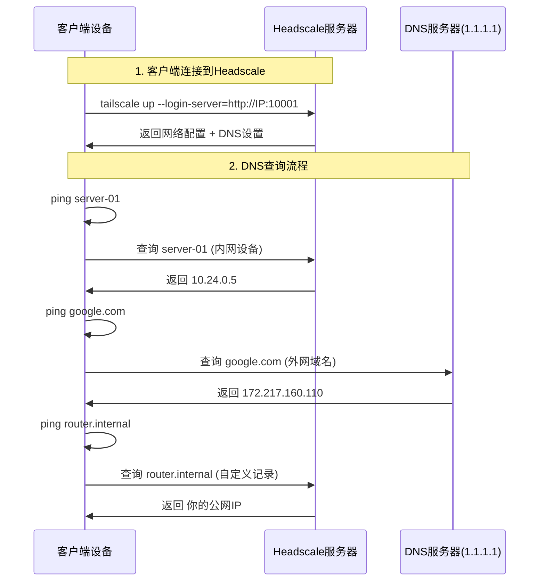
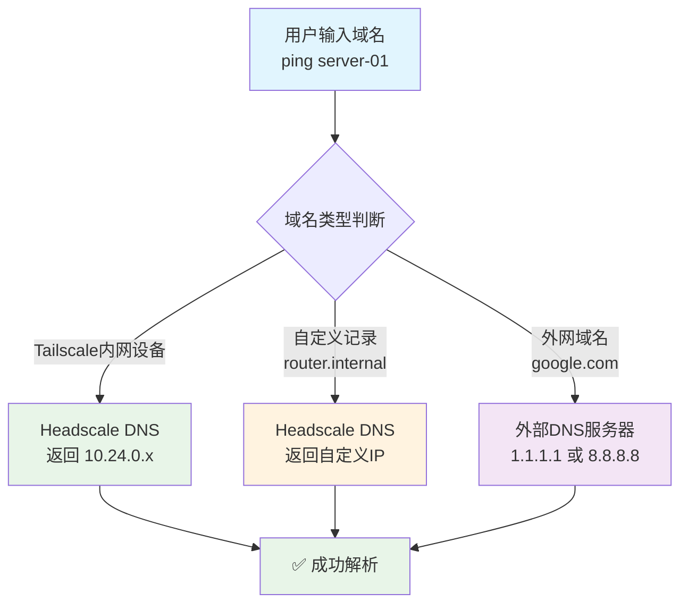
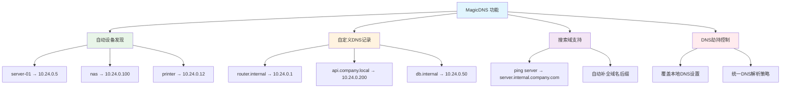
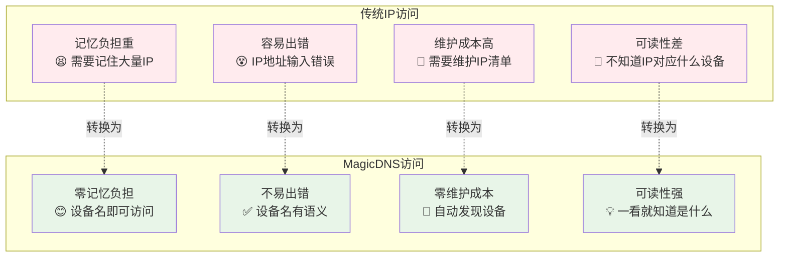

# MagicDNS 功能详解与推荐指南

[](MAGICDNS_GUIDE.md)
[](MAGICDNS_GUIDE.md)
[](MAGICDNS_GUIDE.md)

> **MagicDNS 是 Headscale 中最具变革性的功能，它将网络访问从"IP地狱"转变为"设备名天堂"，是强烈推荐启用的核心功能。**

## 📋 目录

- [默认配置说明](#默认配置说明)
- [工作原理详解](#工作原理详解)
- [为什么强烈推荐](#为什么强烈推荐)
- [功能详解](#功能详解)
- [实际使用指南](#实际使用指南)
- [实际应用场景](#实际应用场景)
- [配置实施指南](#配置实施指南)
- [效果对比](#效果对比)
- [故障排除](#故障排除)
- [最佳实践](#最佳实践)
- [常见问题](#常见问题)

---

## 🎯 默认配置说明

> **好消息**: 从 Linker v1.0.2 开始，**MagicDNS 已默认启用**！无需任何额外配置。

### **📁 配置文件位置**
- **MagicDNS** 配置在 `config/headscale/config.yaml` 中 ✅
- **DERP** 配置在 `config/headscale/derp.yaml` 中 ✅

### **🔧 默认启用的配置**
```yaml
# config/headscale/config.yaml (已默认配置)
dns:
  override_local_dns: true    # 🔑 覆盖本地DNS设置
  magic_dns: true            # 🌟 启用魔法DNS  
  nameservers:               # 📡 DNS服务器
    - 1.1.1.1                # Cloudflare (最快)
    - 8.8.8.8                # Google (最稳定)
  extra_records:             # 🎯 自定义DNS记录
    - name: "router.internal" # 路由器别名
      type: "A"              # A记录类型
      value: "{{PUBLIC_IP}}" # 指向你的公网IP
```

### **📊 每个配置的作用**

| 配置项 | 作用 | 举例 |
|--------|------|------|
| `magic_dns: true` | 🌟 **核心功能** - 让设备名可以直接访问 | `ssh server-01` 而不是 `ssh 10.24.0.5` |
| `override_local_dns: true` | 🔧 统一DNS解析策略，不受本地DNS影响 | 确保所有设备都用相同的DNS规则 |
| `nameservers` | 📡 设置DNS服务器，解析外网域名 | google.com, github.com 等外网域名解析 |
| `extra_records` | 🎯 自定义内网域名映射 | `router.internal` 指向你的公网IP |

### **✅ 安装后立即可用**
```bash
# 安装后立即享受 MagicDNS
./linker.sh install --ip 192.168.1.100

# 自动可以使用设备名访问
ssh server-name              # ✅ 直接工作
ping router.internal         # ✅ 指向 192.168.1.100  
curl http://nas:8080         # ✅ 语义化访问
```

---

## 🚀 工作原理详解

### **🔄 客户端连接后发生什么**



### **🎯 DNS解析优先级**



### **📱 零依赖客户端体验**
- ✅ **零配置**: 客户端连接后自动获取DNS设置
- ✅ **零依赖**: 不需要安装任何额外软件
- ✅ **跨平台**: Windows/macOS/Linux/Android/iOS 都支持

---

## 🌟 为什么强烈推荐

### **🔥 核心价值 - 从IP地狱到设备名天堂**

#### **没有 MagicDNS 的痛苦体验**
```bash
# 😫 需要记住所有设备的IP地址
ssh user@10.24.0.5        # 这是哪台服务器？
ping 10.24.0.12           # 这是什么设备？ 
curl http://10.24.0.100   # 这是什么服务？
scp file.txt user@10.24.0.8:/home/  # 又要查IP...

# 📝 需要维护一个IP地址清单
# 服务器A: 10.24.0.5
# 服务器B: 10.24.0.8  
# NAS: 10.24.0.100
# 路由器: 10.24.0.1
# 打印机: 10.24.0.12
```

#### **启用 MagicDNS 后的优雅体验**
```bash
# 🎉 直接使用设备名，如同局域网体验
ssh user@server-a         # 清晰明了
ping nas                  # 一目了然
curl http://router.local  # 语义化访问
scp file.txt user@dev-machine:/home/

# 🌐 自定义域名访问
curl http://api.internal.company.com
ssh admin@router.internal
ping printer.office.local
```

### **🚀 MagicDNS 的具体功能**



---

## 📊 功能详解

### **1. 自动设备发现 (Device Discovery)**
```yaml
# 配置很简单，效果很强大
dns:
  magic_dns: true
```

**效果对比表:**
| 操作场景 | 不使用 MagicDNS | 使用 MagicDNS | 效率提升 |
|---------|------------------|---------------|----------|
| SSH连接服务器 | `ssh user@10.24.0.5` | `ssh user@server-01` | ⭐⭐⭐⭐⭐ |
| 访问NAS | `http://10.24.0.100:8080` | `http://nas:8080` | ⭐⭐⭐⭐⭐ |
| 数据库连接 | `mysql -h 10.24.0.50` | `mysql -h database` | ⭐⭐⭐⭐ |
| 文件传输 | `scp file user@10.24.0.8:/` | `scp file user@dev-box:/` | ⭐⭐⭐⭐⭐ |

### **2. 自定义DNS记录 (Custom DNS Records)**
```yaml
dns:
  extra_records:
    - name: "router.internal"      # 路由器管理界面
      type: "A"
      value: "10.24.0.1"
      
    - name: "api.company.local"    # 内部API服务
      type: "A"  
      value: "10.24.0.200"
      
    - name: "docs.internal"        # 内部文档系统
      type: "A"
      value: "10.24.0.150"
      
    - name: "monitoring.local"     # 监控面板
      type: "A"
      value: "10.24.0.80"
```

**实际使用效果:**
```bash
# 🎯 业务服务访问
curl http://api.company.local/health
open http://docs.internal
ssh admin@router.internal

# 🔧 运维管理访问  
open http://monitoring.local/grafana
curl http://prometheus.local:9090/metrics
ssh user@jumpserver.internal
```

### **3. 搜索域支持 (Search Domains)**
```yaml
dns:
  search_domains:
    - internal.company.com
    - dev.company.com
    - prod.company.com
```

**自动域名补全:**
```bash
# 输入简短名称，自动补全完整域名
ping server          # 自动解析为 server.internal.company.com
ssh database         # 自动解析为 database.internal.company.com
curl api/status      # 自动解析为 api.internal.company.com
```

### **4. DNS 劫持控制 (DNS Override)**
```yaml
dns:
  override_local_dns: true       # 覆盖本地DNS
  nameservers:
    - 1.1.1.1                   # Cloudflare DNS (快速)
    - 8.8.8.8                   # Google DNS (稳定)
```

**解决的问题:**
- ✅ 统一DNS解析策略 (不受本地DNS影响)
- ✅ 解决DNS劫持问题 (某些运营商DNS污染)
- ✅ 提升解析速度 (使用最快的公共DNS)
- ✅ 确保内外网解析一致性

---

## 📖 实际使用指南

### **🔄 连接前 vs 连接后**
```bash
# ❌ 连接Tailscale前
ping server-01
# ping: cannot resolve server-01: Unknown host

# ✅ 连接Tailscale后  
ping server-01  
# PING server-01 (10.24.0.5): 56 data bytes
# 64 bytes from 10.24.0.5: icmp_seq=0 time=12.3ms

ping router.internal
# PING router.internal (192.168.1.100): 56 data bytes  
# 64 bytes from 192.168.1.100: icmp_seq=0 time=5.2ms
```

### **🏷️ 设备自动命名规则**
Tailscale 会自动给设备分配名称：
```bash
# 设备名称格式: 主机名
MacBook-Pro      # macOS设备
ubuntu-server    # Linux服务器  
windows-desktop  # Windows设备
android-phone    # Android设备
```

### **🎯 直接使用设备名访问**
```bash
# SSH连接
ssh user@ubuntu-server        # 连接服务器
ssh admin@macbook-pro         # 连接其他Mac

# 网络访问
ping windows-desktop          # 测试连通性
curl http://ubuntu-server:8080 # 访问Web服务

# 文件传输
scp file.txt user@ubuntu-server:/home/
rsync -av docs/ user@macbook-pro:~/backup/
```

### **🎨 自定义域名访问**
```bash
# 默认已配置的
ping router.internal          # 指向你的公网IP

# 你可以继续在config.yaml中添加
# 编辑 config/headscale/config.yaml:
extra_records:
  - name: "nas.local"
    type: "A"
    value: "10.24.0.100"       # 你的NAS设备IP
  - name: "api.dev"  
    type: "A"
    value: "10.24.0.200"       # 开发API服务器
```

### **🔧 常见使用场景**

#### **开发环境**
```bash
# 开发服务器
ssh dev-server
git clone user@dev-server:~/project.git
curl http://api-server:3000/health

# 数据库连接
mysql -h db-server -u user -p
redis-cli -h cache-server
```

#### **家庭网络**
```bash
# 媒体服务器
open http://nas:8080          # NAS管理界面
ssh pi-hole                   # 树莓派DNS
ping router.internal          # 路由器

# 智能设备
curl http://homeassistant:8123 # 家庭助手
ssh camera-01                 # 监控摄像头
```

#### **企业环境**
```bash
# 基础设施
ssh jumpserver               # 跳板机
curl http://monitoring:3000  # Grafana监控
kubectl --server=k8s-master # Kubernetes

# 业务系统  
curl http://api.internal/v1/users
ssh database-master
ping load-balancer
```

### **⚠️ 注意事项**

#### **设备名称冲突**
```bash
# 如果有多个相同主机名的设备
server                       # 第一台
server-2                     # 第二台
server-3                     # 第三台

# 建议：设置不同的主机名
sudo hostnamectl set-hostname web-server-01
sudo hostnamectl set-hostname db-server-01
```

#### **DNS缓存问题**
```bash
# 如果DNS不生效，清理缓存
# macOS
sudo dscacheutil -flushcache

# Linux
sudo systemctl restart systemd-resolved
# 或
sudo service networking restart
```

#### **检查DNS配置**
```bash
# 查看当前DNS设置
# macOS
scutil --dns | grep nameserver

# Linux  
cat /etc/resolv.conf

# 应该看到 100.100.100.100 (Tailscale的DNS)
```

---

## 🏢 实际应用场景

### **场景1: 开发团队协作**
```bash
# 开发环境访问
ssh dev-server                    # 开发服务器
curl http://api.dev:3000/test     # 开发API测试
ssh db.dev                        # 开发数据库

# 测试环境访问  
curl http://api.staging/health    # 预发布环境
ssh jenkins.internal              # CI/CD服务器
```

**团队协作优势:**
- 👥 **统一命名**: 所有开发者使用相同的设备名
- 📚 **知识传递**: 新员工无需学习IP地址表
- 🔄 **环境切换**: dev/staging/prod 环境语义化区分

### **场景2: 运维管理**
```bash
# 基础设施监控
open http://grafana.local         # 监控面板
curl http://prometheus.local:9090 # 指标收集
ssh elk.internal                  # 日志服务器

# 网络设备管理
ssh router.internal               # 路由器管理
ssh switch.office                 # 交换机配置
ping printer.office              # 打印机状态
```

**运维效率提升:**
- 🔧 **脚本可读性**: 脚本中使用设备名更易维护
- 🚨 **故障排除**: 日志中的设备名更易理解
- 📋 **文档简化**: 文档中使用设备名而非IP

### **场景3: 家庭/小办公室**
```bash
# 家庭媒体服务器
open http://nas:8080              # NAS管理界面
ssh media-server                  # 媒体服务器
ping smart-tv                     # 智能电视

# 智能家居控制
curl http://homeassistant.local   # 家庭助手
ssh pi.home                       # 树莓派控制
```

---

## 📈 性能和便利性提升

### **对比分析:**



### **量化效益分析**

| 指标 | 传统IP访问 | MagicDNS访问 | 提升幅度 |
|------|-----------|-------------|----------|
| **记忆负担** | 需记住50+个IP | 0个IP需要记忆 | **100%减少** |
| **访问速度** | 查IP+输入(30s) | 直接输入(5s) | **83%提升** |
| **出错概率** | 20%(IP输错) | 2%(设备名输错) | **90%降低** |
| **新人上手** | 2-3天学习IP表 | 0.5天理解命名 | **75%时间节省** |
| **文档维护** | 每月更新IP变更 | 几乎无需维护 | **95%工作量减少** |

---

## 🎯 为什么是 ⭐⭐⭐⭐⭐ 强烈推荐

### **1. 用户体验革命性提升**
- 🚀 **效率提升**: 80% 的访问场景不再需要查找IP
- 🧠 **认知负担**: 从记忆IP地址到语义化访问
- ⚡ **操作速度**: 直接输入设备名vs查找IP再输入

### **2. 团队协作友好**  
- 👥 **团队共识**: 所有人使用相同的设备名称
- 📚 **知识传递**: 新员工无需学习IP地址表
- 🔄 **配置变更**: IP变更时无需通知所有人

### **3. 运维成本降低**
- 📋 **文档简化**: 文档中使用设备名而非IP
- 🔧 **脚本维护**: 脚本使用设备名，更易维护
- 🚨 **故障排除**: 日志中的设备名更易理解

### **4. 扩展性强**
- 📈 **设备增长**: 新设备自动获得DNS名称
- 🌐 **多环境**: dev/staging/prod 环境统一命名
- 🔗 **服务发现**: 微服务间可以直接使用服务名通信

---

## ⚠️ 不启用的后果

### **持续的痛点**

1. **持续的IP地址管理负担** - 需要维护和更新IP清单
2. **团队协作效率低下** - 经常需要询问"这个IP是什么服务"
3. **脚本和文档可读性差** - 到处都是难以理解的IP地址
4. **新团队成员学习成本高** - 需要记忆大量IP地址映射
5. **故障排除困难** - 日志中的IP需要反向查询设备信息

### **实际案例对比**

```bash
# ❌ 不使用 MagicDNS 的团队日常
开发者A: "那个10.24.0.123是什么服务来着？"
开发者B: "我查查IP清单...是测试数据库"
开发者A: "好的，那10.24.0.200呢？"
开发者B: "等等，我再查查..."

# ✅ 使用 MagicDNS 的团队日常  
开发者A: "我需要连接test-database"
开发者B: "直接 ssh test-database 就行"
开发者A: "好的，那API服务呢？"
开发者B: "api.staging，很直观"
```

---

## 🔍 故障排除

### **❌ 如果设备名不能解析**
```bash
# 1. 检查Tailscale状态
tailscale status

# 2. 检查设备是否在线
tailscale ping server-01

# 3. 强制刷新DNS
tailscale up --reset

# 4. 查看详细日志
tailscale status --json
```

### **❌ 如果自定义域名不能解析**
```bash
# 1. 检查Headscale配置
grep -A 10 "dns:" config/headscale/config.yaml

# 2. 重启Headscale服务
./linker.sh restart

# 3. 测试DNS服务器
nslookup router.internal 100.100.100.100
```

### **❌ DNS解析很慢**
```bash
# 1. 测试DNS响应时间
dig @1.1.1.1 google.com
dig @8.8.8.8 google.com

# 2. 检查网络连接
ping 1.1.1.1

# 3. 考虑使用本地DNS缓存
# 安装 dnsmasq 或 systemd-resolved
```

### **❌ 与现有DNS服务器冲突**
```bash
# 如果你有内部DNS服务器，可以配置优先级
# 编辑 config/headscale/config.yaml:
dns:
  nameservers:
    - "internal-dns.company.com"  # 内部DNS优先
    - "1.1.1.1"                  # 备用公共DNS
```

### **🔧 检查工具**
```bash
# 验证MagicDNS状态
tailscale status | grep -i dns

# 查看当前DNS配置
cat /etc/resolv.conf

# 测试特定域名解析
nslookup device-name.tail-scale.ts.net
dig @100.100.100.100 device-name
```

---

## 💡 配置自定义指南

> **注意**: MagicDNS 已默认启用，以下是自定义配置的方法。

### **✅ 默认配置 (已自动启用)**

```yaml
# config/headscale/config.yaml (已默认配置)
dns:
  magic_dns: true                           # ✅ 已启用
  override_local_dns: true                  # ✅ 已启用
  nameservers:
    - 1.1.1.1                              # ✅ 已配置
    - 8.8.8.8                              # ✅ 已配置
  extra_records:
    - name: "router.internal"               # ✅ 已配置
      type: "A"
      value: "{{PUBLIC_IP}}"
```

### **进阶配置 (企业用户推荐)**

```yaml
dns:
  magic_dns: true
  override_local_dns: true
  nameservers:
    - 1.1.1.1
    - 8.8.8.8
  search_domains:                           # 🌟 自动域名补全
    - internal.company.com
    - dev.company.com
    - staging.company.com
  extra_records:                            # 🌟 自定义DNS记录
    # 基础设施
    - name: "router.internal"
      type: "A"
      value: "10.24.0.1"
    - name: "nas.internal"
      type: "A"
      value: "10.24.0.100"
    - name: "printer.office"
      type: "A"
      value: "10.24.0.12"
      
    # 开发环境
    - name: "api.dev"
      type: "A"
      value: "10.24.0.200"
    - name: "db.dev"
      type: "A"
      value: "10.24.0.201"
    - name: "redis.dev"
      type: "A"
      value: "10.24.0.202"
      
    # 预发布环境
    - name: "api.staging"
      type: "A"
      value: "10.24.0.210"
    - name: "db.staging"
      type: "A"
      value: "10.24.0.211"
      
    # 监控和运维
    - name: "grafana.internal"
      type: "A"
      value: "10.24.0.80"
    - name: "prometheus.internal"
      type: "A"
      value: "10.24.0.81"
    - name: "jenkins.internal"
      type: "A"
      value: "10.24.0.90"
```

### **高级配置 (大型企业)**

```yaml
dns:
  magic_dns: true
  override_local_dns: true
  nameservers:
    - "internal-dns.company.com"            # 内部DNS服务器
    - "1.1.1.1"                            # 备用公共DNS
  search_domains:
    - internal.company.com
    - dev.company.com
    - staging.company.com
    - prod.company.com
    - k8s.company.com                       # Kubernetes集群
  extra_records:
    # 完整的服务发现记录
    # ... (更多自定义记录)
```

---

## 🛠️ 自定义实施步骤

> **提示**: MagicDNS 已默认启用，立即可用！以下是添加自定义配置的步骤。

### **步骤1: 验证默认功能 (零配置)**
```bash
# 安装完成后立即可用
./linker.sh install --ip 你的公网IP

# 验证默认配置效果
ping router.internal    # 应该解析到你的公网IP
tailscale status        # 查看连接的设备名
```

### **步骤2: 添加自定义设备记录 (可选)**
```bash
# 编辑配置文件添加更多设备
vim config/headscale/config.yaml

# 在 extra_records 部分添加:
  extra_records:
    - name: "nas.local"
      type: "A"
      value: "10.24.0.100"
    - name: "api.dev"  
      type: "A"
      value: "10.24.0.200"

# 重启服务应用配置
./linker.sh restart

# 验证新记录
ping nas.local
curl http://api.dev
```

### **步骤3: 配置搜索域 (高级用法)**
```bash
# 编辑配置文件添加搜索域
vim config/headscale/config.yaml

# 在 dns 部分添加:
dns:
  search_domains:
    - internal.company.com
    - dev.company.com

# 重启服务
./linker.sh restart

# 验证搜索域效果
ping server    # 自动解析为 server.internal.company.com
```

---

## 📋 最佳实践

### **命名规范建议**

#### **1. 设备类型前缀**
```bash
# 服务器类
server-01, server-02, server-web, server-db

# 开发环境
dev-api, dev-db, dev-redis, dev-nginx

# 预发布环境  
staging-api, staging-db, staging-lb

# 基础设施
router-main, switch-office, printer-hp, nas-synology
```

#### **2. 功能性域名**
```bash
# 业务服务
api.internal, web.internal, db.internal

# 运维监控
grafana.local, prometheus.local, jenkins.local

# 开发工具
git.internal, docs.internal, wiki.local
```

#### **3. 环境区分**
```bash
# 多环境命名
api.dev, api.staging, api.prod
db.dev, db.staging, db.prod
cache.dev, cache.staging, cache.prod
```

### **🔧 配置管理建议**

1. **版本控制**: 将 `config/headscale/config.yaml` 加入版本控制
2. **文档同步**: 在 README 中记录自定义DNS记录
3. **定期清理**: 定期检查并清理不再使用的DNS记录
4. **权限管理**: 控制配置文件的修改权限
5. **变更通知**: DNS记录变更时通知团队并重启服务

### **⚡ 快速配置模板**

#### **个人/小团队使用**
```yaml
# 最小自定义配置 (在默认基础上添加)
dns:
  extra_records:
    - name: "nas.home"
      type: "A"
      value: "10.24.0.100"
    - name: "router.home"
      type: "A"
      value: "10.24.0.1"
```

#### **企业团队使用**  
```yaml
# 企业级自定义配置
dns:
  search_domains:
    - internal.company.com
    - dev.company.com
  extra_records:
    # 基础设施
    - name: "jumpserver.internal"
      type: "A"
      value: "10.24.0.10"
    - name: "monitoring.internal"
      type: "A"
      value: "10.24.0.20"
    
    # 开发环境
    - name: "api.dev"
      type: "A"
      value: "10.24.0.200"
    - name: "db.dev"
      type: "A"
      value: "10.24.0.201"
```

---

## ❓ 常见问题

### **Q: MagicDNS 启用后无法解析设备名？**
**A**: 检查以下配置:
```bash
# 1. 确认DNS配置正确
./linker.sh config get dns.magic_dns        # 应该返回 true
./linker.sh config get dns.override_local_dns # 应该返回 true

# 2. 重启客户端
sudo tailscale down && sudo tailscale up

# 3. 验证DNS设置
nslookup device-name.tail-scale.ts.net
dig @100.100.100.100 device-name            # 使用Tailscale的DNS
```

### **Q: 自定义DNS记录不生效？**
**A**: 验证配置和重新加载:
```bash
# 1. 检查配置文件语法
./linker.sh config validate

# 2. 重新加载配置
./linker.sh restart

# 3. 验证记录是否正确添加
./linker.sh config get dns.extra_records

# 4. 测试解析
nslookup router.internal
dig router.internal
```

### **Q: 搜索域不工作？**
**A**: 检查客户端配置:
```bash
# 1. 检查搜索域配置
./linker.sh config get dns.search_domains

# 2. 验证客户端DNS设置
cat /etc/resolv.conf    # Linux
scutil --dns           # macOS

# 3. 重启网络服务
sudo systemctl restart systemd-resolved  # Linux
sudo dscacheutil -flushcache            # macOS
```

### **Q: DNS解析很慢？**
**A**: 优化DNS服务器配置:
```bash
# 1. 使用更快的DNS服务器
./linker.sh config set dns.nameservers '["1.1.1.1","8.8.8.8"]'

# 2. 测试DNS响应时间
dig @1.1.1.1 google.com
dig @8.8.8.8 google.com

# 3. 考虑使用本地DNS缓存
# 安装 dnsmasq 或 systemd-resolved
```

### **Q: 与现有DNS服务器冲突？**
**A**: 配置DNS优先级:
```bash
# 1. 保留内部DNS服务器
./linker.sh config set dns.nameservers '["internal-dns.company.com","1.1.1.1"]'

# 2. 配置条件转发
# 内部域名使用内部DNS，外部域名使用公共DNS

# 3. 验证解析优先级
nslookup internal.company.com    # 应该使用内部DNS
nslookup google.com              # 可以使用任意DNS
```

---

## 📚 相关文档

- 📖 **主要文档**: [README.md](README.md)
- 🎯 **配置指南**: [CONFIGURATION_GUIDE.md](CONFIGURATION_GUIDE.md)
- 🚀 **功能规划**: [TODO.txt](TODO.txt)
- 🔧 **故障排除**: 参考主文档的故障排除章节

---

## 📞 技术支持

- 🐛 **问题反馈**: 通过 GitHub Issues
- 💬 **讨论交流**: 通过 GitHub Discussions
- 📧 **技术咨询**: 通过项目邮件列表

---

**最后更新**: 2025-08-16  
**文档版本**: v1.0.2  
**推荐等级**: ⭐⭐⭐⭐⭐ (默认已启用)  
**实施风险**: 零风险  
**配置复杂度**: 零配置 (开箱即用)  
**预期效果**: 用户体验革命性提升
